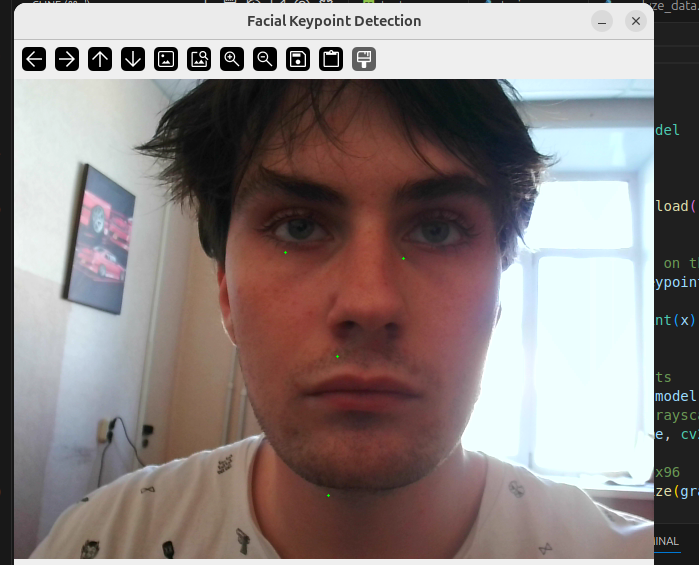

# Проект по распознаванию ключевых точек лица

Этот проект предназначен для распознавания ключевых точек на изображении лица.

## Как протестировать

1.  **Настройка окружения:**
    *   Убедитесь, что у вас установлен Python. ГЛАВНОЕ МОЛЮ ЧТОБЫ БЫЛО ПИТОН 3.10!!! НА ДРУГИХ ВЕРСИЯХ ОТВАЛИВАЕТСЯ!
    *   Рекомендуется использовать виртуальное окружение.
    ```bash
    python -m venv myvenv
    source myvenv/bin/activate
    ```
    *   Установите необходимые зависимости:
    ```bash
    pip install -r requirements.txt 
    ```
    *(Примечание: файл `requirements.txt` отсутствует. Возможно, вам потребуется создать его на основе импортов в проекте.)*

2.  **Обучение модели (при необходимости):**
    *   Данные для обучения ожидаются в файле `training.csv`.     (ССЫЛКА ИЗ САМОГО ДАТАСЕТА БРАЛ С КЕГЛА! КОТОЫРЙ БЫЛ УКАЗАН В АТТЕСТАЦИИ ПРЕПОДОМ!   https://www.kaggle.com/competitions/facial-keypoints-detection/overview  )
    *   Запустите скрипт обучения:
    ```bash
    python train.py
    ```

3.  **Запуск основного приложения:**
    *   Основной скрипт обработает изображение и отобразит результаты.
    ```bash
    python main.py
    ```

## Пример результата

Вот пример вывода модели на тестовом изображении:


